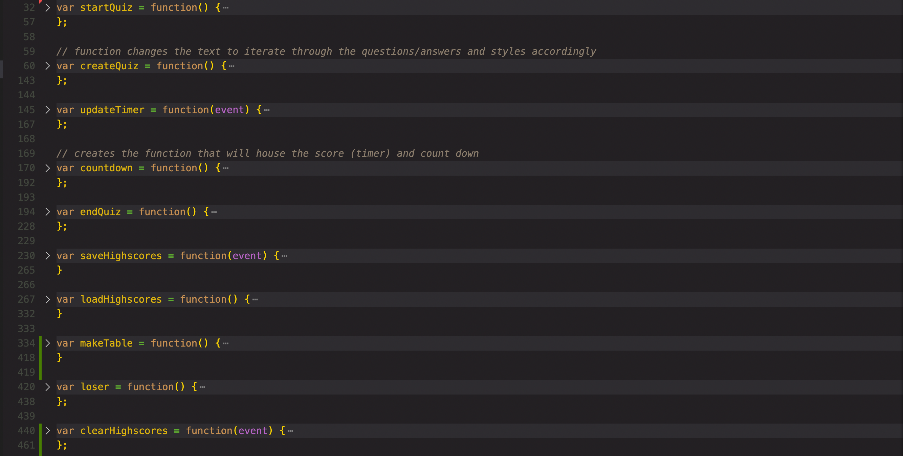
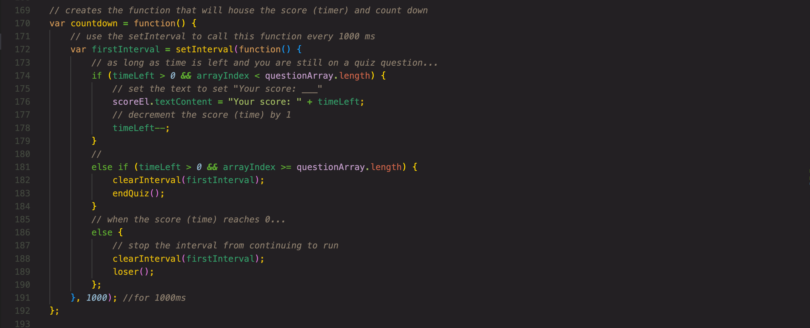
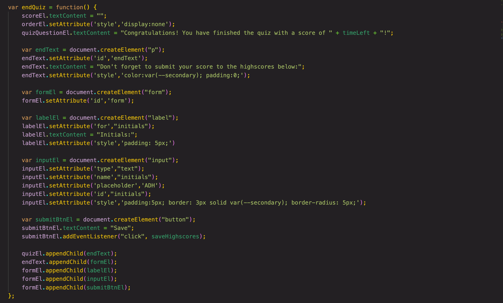

# Javascript Pop Quiz
## Description
The object of this program is to test the user over their knowledge of Javascript based on an timed quiz. The quiz begins with a start button and iterates through five questions. For correct questions, 5 seconds are added to the time. For incorrect questions, 10 seconds are deducted from the timer. At the end the user has the option to save thier initials and score to the highscores list. The save button will route the use back to the homescreen where they can view the highscores in the upper left corner. This displays a table of any available highscores within the localStorage. If the user gets enough answers wrong or the timer naturally runs out, the user will be prompted to replay the game.

## Built With:
* HTML
* CSS
* JavaScript

## Key Features:
### Use of Logical Functions
The code is organized into several different functions used to manipulate all the working parts of the quiz. While it is not as concise as desired, iteration throughout loops and functions is used to make the code more readable and perform efficiently.

### Timer
A timer was used to eventually calculate the score for the user or to end the quiz prior to completion if the user takes too long / gets too many incorrect answers. The setInterval was used for this timer with conditions referring to the timer itself as well as the length of the quiz to determine 1) does the user still have time and more questinos? Continue quiz... 2) Does the user have more time but ran out of questions? They won. End quiz. OR 3) Did the timer run out? The user lost the game :/ Ask them to retry.

### JavaScript DOM Manipulation
The entire quiz is populated on one single page of HTML that is dynamically maniupulated by the use of JavaScript DOM manipulation. Throughout the code, various ways of creating, targeting, and setting attributes/classes/ids are used for the interactive design to function appropriately. Very limited HTML and CSS was written to achieve the desired outcome, and truly, even most of the hardcoded HTML and CSS could be converted to Javascript if time allotted.

View the live page [here]()